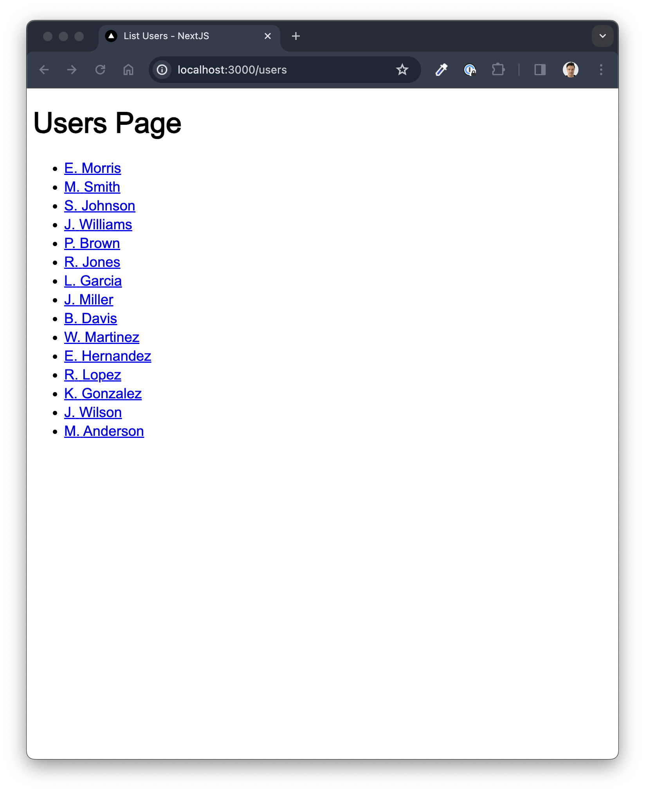
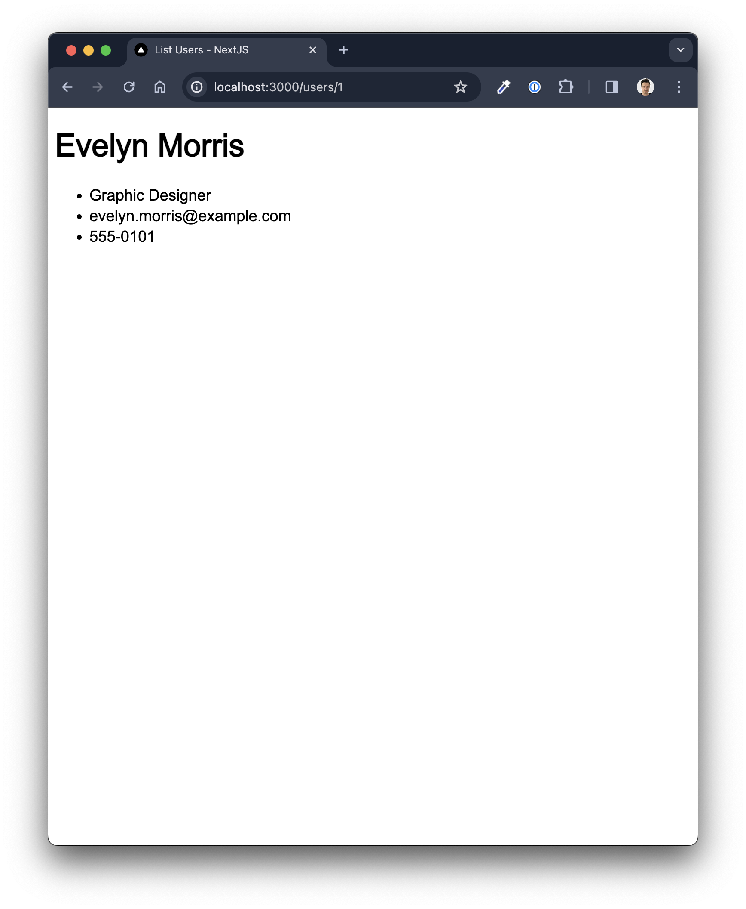

# User List with Routing in NextJS

A simple app to demonstrate routing with NextJS 14 and mapping user data.

## To use the app

- Clone the repo to your machine
- Move into the folder
- In your terminal run

```bash
npm install
npm run dev
```

Open [http://localhost:3000/users](http://localhost:3000/users) with your browser to see the app.

## Screenshots




## How it works

Unlike older versions of routing with React Router, this method looks to the `/app` folder then within that directory and each subdirectory, looks for a folder with the reserved keyword, `/page`.

### Examples

For the page with all the users in this app, you head to `{base_url}/users`. In the folder structure this is found through `./app/users/page.tsx`.

To access dynamic pages you can place a reference in a subfolder in square brackets. In this app, the URL, `{base_url}/users/1` returns the first user. In the folder structure you use `./app/users/[id]/page.tsx`. The `id` value can then be used in the `page.tsx` file like so:

```typescript
export default function Page({ params }: { params: { id: string } }) {
  const { id } = params; // <-- Accessed here
  ...
}
```
